# Red Hat Status Che- [📊 Core Features](#-core-features)
- [🏭 Enterprise Features](#-enterprise-features)
  - [Statistical Analysis and Forecasting](#statistical-analysis-and-forecasting)
  - [Multi-Channel Notifications](#multi-channel-notifications)
  - [Database Management](#database-management)
- [⚙️ Configuration](#️-configuration)
- [📋 Command Line Interface](#-command-line-interface)
- [🔧 Troubleshooting](#-troubleshooting)

A comprehensive, enterprise-grade Python monitoring solution for Red Hat services, featuring a modular architecture, statistical analytics, and a Prometheus exporter.

**Version:** 3.1.1 - Production Edition

## Table of Contents

- [🚀 Overview](#-overview)
- [✨ Key Features](#-key-features)
- [🏗️ Architecture](#️-architecture)
- [🏆 Red Hat Enterprise Integration](#-red-hat-enterprise-integration)
  - [Prometheus Exporter](#prometheus-exporter)
- [� System Requirements](#-system-requirements)
- [�🚀 Quick Start](#-quick-start)
- [📊 Core Features](#-core-features)
- [🏭 Enterprise Features](#-enterprise-features)
  - [Statistical Analysis and Forecasting](#statistical-analysis-and-forecasting)
  - [Multi-Channel Notifications](#multi-channel-notifications)
  - [Database Management](#database-management)
- [ Command Line Interface](#-command-line-interface)
- [🔧 Troubleshooting](#-troubleshooting)

---

## 🚀 Overview

The Red Hat Status Checker is a sophisticated monitoring platform that provides real-time and historical visibility into Red Hat's service health. Built with a modular, cloud-native architecture, it is designed for enterprise scalability, maintainability, and seamless integration with modern DevOps and SRE workflows.

This tool goes beyond simple status checking by storing historical data, performing statistical analysis to detect anomalies and forecast trends, and exposing this data through a comprehensive CLI and a Prometheus exporter.

## ✨ Key Features

- 🏗️ **Modular Architecture**: Professional, maintainable codebase with clear separation of concerns.
- 📈 **Statistical Analysis & Forecasting**:
  - **Anomaly Detection**: Uses Z-score statistical analysis to identify significant deviations from performance baselines.
  - **Trend Forecasting**: Employs linear regression to predict future service health trends.
- 📊 **Multiple Interfaces**: Access data via a comprehensive **CLI** or a **Prometheus Exporter**.
- 💾 **Data Persistence**: Stores historical status data in a local SQLite database for trend analysis.
- 🔔 **Multi-Channel Alerting**: Delivers notifications through email and webhooks (Slack, Teams, etc.).

## 🏗️ Architecture

The application is designed with a clean separation of concerns, making it easy to maintain and extend.

```mermaid
graph TD
    subgraph "User Interfaces"
        CLI[💻 Command Line Interface]
        Exporter[📈 Prometheus Exporter]
    end

    subgraph "Application Core"
        Main[main.py]
        Config[Config Manager]
        APIClient[API Client]
        Presenter[Presenter]
    end

    subgraph "Enterprise Modules"
        direction LR
        Analytics[🤖 Statistical Analytics]
        Database[💾 Database Manager]
        Notifications[🔔 Notification Manager]
    end

    subgraph "External Systems"
        direction LR
        RedHatAPI[Red Hat Status API]
        Prometheus[Prometheus Server]
        SMTP[Email/Webhook Services]
    end

    CLI --> Main
    Exporter --> Main
    Main --> Config
    Main --> APIClient
    Main --> Presenter
    Main --> Analytics
    Main --> Database
    Main --> Notifications
    
    APIClient --> RedHatAPI
    APIClient --> Database
    Analytics --> Database
    Notifications --> SMTP
    Exporter --> Prometheus
```



## 🏆 Red Hat Enterprise Integration

This tool is designed to provide maximum value within the Red Hat ecosystem.

### Prometheus Exporter

The built-in Prometheus exporter allows for seamless integration with monitoring systems.

- **Run the exporter**: `python3 redhat_status.py --enable-exporter`
- **Scrape Metrics**: Configure your monitoring stack to scrape the `/metrics` endpoint on port 8000.
- **Build Dashboards**: Use the exported metrics to build Grafana dashboards and configure alerting rules.

---

## � System Requirements

### Python Requirements
- **Python 3.8 or higher** (compatible with 3.8, 3.9, 3.10, 3.11, 3.12)
- **pip package manager**

### System Dependencies
- **SQLite3**: Required for database operations and command-line database tools
  ```bash
  # Ubuntu/Debian
  sudo apt update
  sudo apt install sqlite3
  
  # RHEL/CentOS/Fedora
  sudo dnf install sqlite
  
  # macOS
  brew install sqlite3
  ```

### Python Dependencies
All Python dependencies are automatically managed through `requirements.txt`:

**Core Dependencies:**
- `requests>=2.25.0` - HTTP API client
- `urllib3>=1.26.0` - HTTP connection pooling  
- `prometheus-client>=0.14.0` - Metrics export
- `numpy>=1.20.0` - Statistical analysis

**Note**: All built-in Python modules (`sqlite3`, `json`, `logging`, etc.) are included with Python 3.8+.

---

## �🚀 Quick Start

1.  **Clone the repository**:
    ```bash
    git clone <repository_url>
    cd redhat-status-checker
    ```

2.  **Install dependencies**:
    ```bash
    pip install -r requirements.txt
    ```

3.  **Run a quick check**:
    ```bash
    python3 redhat_status.py quick
    ```

4.  **Run the Prometheus Exporter**:
    ```bash
    python3 redhat_status.py --enable-exporter
    ```

## 📊 Core Features

- **Global Status Monitoring**: Real-time status with overall availability percentage.
- **Service Hierarchy Analysis**: View status for main services and their sub-components.
- **Performance Metrics**: Track API response times and cache efficiency.
- **Data Export**: Export raw data to JSON or summary reports to text files.

## 🏭 Enterprise Features

### Statistical Analysis and Forecasting

This tool uses historical data to provide intelligent insights without the overhead of a full machine learning framework.

-   **Anomaly Detection**: By calculating a historical baseline for each service, the tool can identify statistically significant deviations from normal behavior using a **Z-score**. This helps detect subtle performance degradations before they become major issues.
-   **Trend Forecasting**: Using **simple linear regression**, the tool can forecast future availability and performance trends, helping teams to proactively address potential problems.

```bash
# Get a summary of the latest analytics
python3 redhat_status.py --analytics-summary

# View current availability trends
python3 redhat_status.py --trends
```

### Multi-Channel Notifications

- **Email Alerts**: SMTP-based notifications with HTML templates.
- **Webhook Integration**: Send alerts to Slack, Microsoft Teams, Discord, and other compatible services.
- **Configurable Rules**: Control when and how notifications are sent.

### Database Management

- **SQLite Storage**: A self-contained SQLite database stores historical metrics for analysis.
- **Data Retention**: Configuration options for automatic data cleanup and retention policies.
- **Performance Optimized**: The database is indexed and can be manually maintained for optimal performance.

## ⚙️ Configuration

Application behavior is controlled by `config.json`. Key sections include:
- `api`: Red Hat Status API endpoint and retry settings.
- `cache`: Caching TTL, size, and compression.
- `database`: Database path and data retention settings.
- `ai_analytics`: Configuration for anomaly detection and forecasting sensitivity.
- `notifications`: SMTP and webhook settings.

## 📋 Command Line Interface

The application provides a rich CLI for scripting and automation.

| Mode | Description |
|---|---|
| `quick` | Global status with availability percentage. |
| `simple`| Main services monitoring. |
| `full`  | Complete service hierarchy. |
| `export`| Export data to files. |

**Common Flags:**
- `--watch <seconds>`: Run in live monitoring mode.
- `--filter <status>`: Filter services by status (`issues`, `operational`, etc.).
- `--search <term>`: Search for a specific service by name.
- `--performance`: Show performance metrics after a run.
- `--enable-exporter`: Run the Prometheus exporter.

**Advanced Analytics Flags:**
- `--ai-insights`: AI-powered health analysis and anomaly detection.
- `--health-report`: Comprehensive health report with statistics.
- `--trends`: Historical availability trends and analysis.
- `--anomaly-analysis`: Focused anomaly detection analysis.
- `--benchmark`: Performance benchmark tests for system components.

For a full list of commands, run `python3 redhat_status.py --help`.

---

## 🔧 Troubleshooting

### Common Issues and Solutions

#### Database Issues
- **Error: "no such table: service_statuses"**
  - This has been fixed in the current version
  - If you encounter this, ensure you're using the latest code

- **Error: "UNIQUE constraint failed: service_snapshots.timestamp"**
  - This occurs when running the application multiple times per second
  - Fixed with `INSERT OR REPLACE` logic in the current version

#### SQLite Issues
- **Error: "sqlite3 command not found"**
  ```bash
  # Ubuntu/Debian
  sudo apt install sqlite3
  
  # RHEL/CentOS/Fedora
  sudo dnf install sqlite
  
  # macOS
  brew install sqlite3
  ```

#### Email Notification Warnings
- **Warning: "Email configuration invalid"**
  - This is expected with default configuration
  - Configure valid SMTP settings in `config.json` to enable email notifications
  - The warning has been reduced to INFO level and won't appear during normal operation

#### AI Analytics Issues
- **Error: "Insufficient data for predictions"**
  - This is normal when the application is first run
  - Run `quick` or `simple` mode several times to collect baseline data
  - Historical data is required for trend analysis and anomaly detection

#### Performance Issues
- **Slow database operations**
  - Ensure SQLite database file isn't on a network filesystem
  - Check disk space and I/O performance
  - Database is automatically optimized with indexes

### Getting Help
- Check the logs in `redhat_status.log`
- Run with `--benchmark` to test system performance
- Use `--health-report` to check overall system status
- Review configuration in `config.json` for customization options

---
